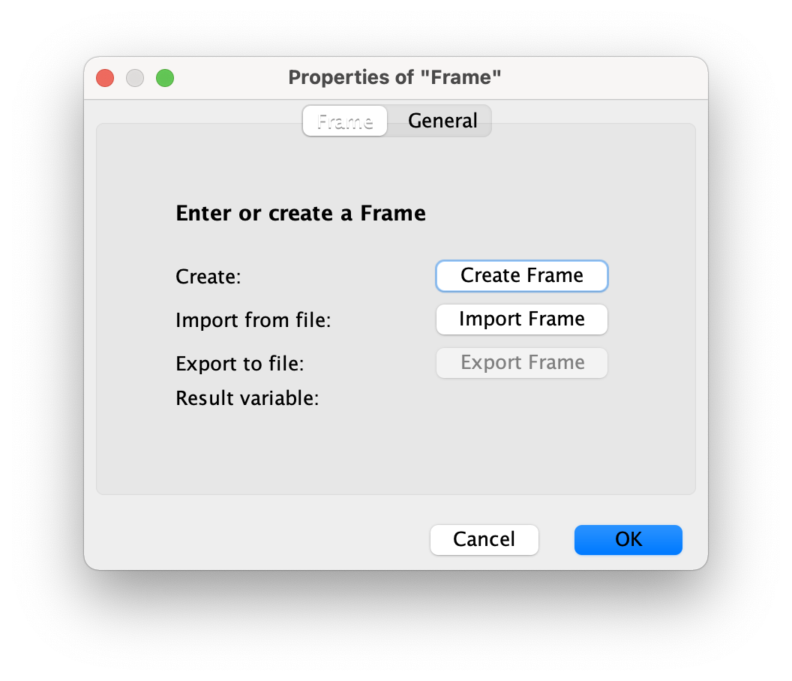
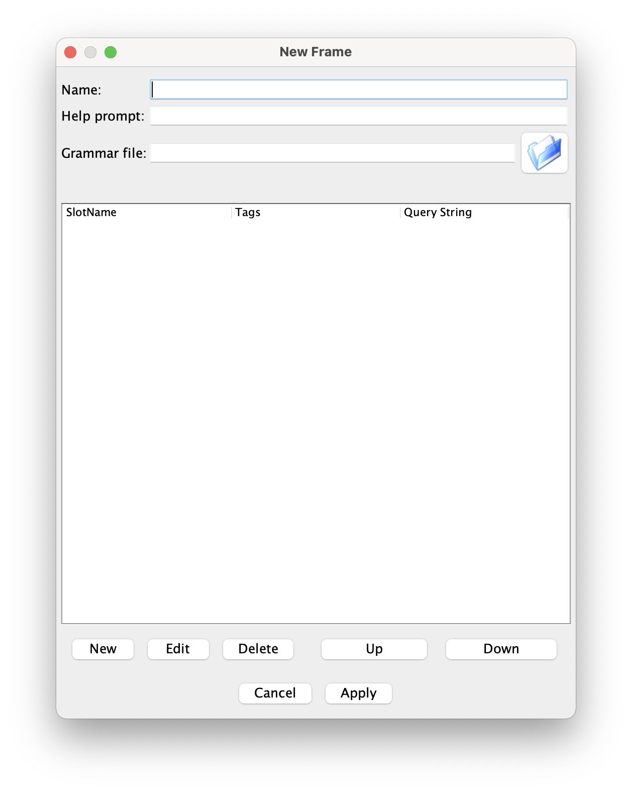
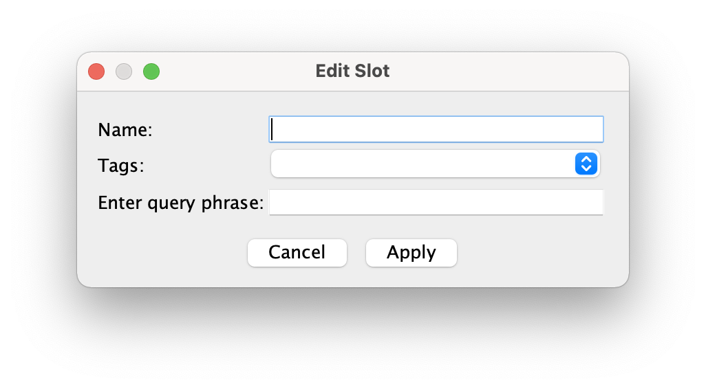

# dialogos-plugin-frame

A plugin to automatically generate dialogue graphs based on a frame.

## Starting the plugin
Start a DialogOS-instance that includes the plugin using the following command: 

`./gradlew run`

## How to use the FrameNode

A small introduction on how to use the `FrameNode`.

The `FrameNode` can generate a dialogue-graph that represents a frame-based dialogue system. Based on the frame you
enter in the *Properties* of the `FrameNode` a subgraph/procedure will be generated that will try to collect the
information specified in the frame.

### Properties

The properties are used to edit, import or export the frame of the node.

Using the properties it's possible to create a new frame from scratch. The `Create Frame` option opens an editor window
to enter the frame.

The name of the frame is the specifier. The help prompt will be given at the start of the dialogue. It should contain a
summary of the needed information, so that users will know what to enter. The grammar file is an xml file that can
contain multiple grammars. These will be loaded into DialogOS and can be used as a tag for a slot. It is also possible
to add grammars manually to the DialogOS-graph and use them as tags. However they need to be present in order to select
them as a tag.

The `Up` and `Down` buttons are used for changing the order of a selected slot. This is especially important when using
a grammar multiple times. If this is the case, the slots will be filled in the same order as they are in the frame.

Using the three buttons on the bottom left it is possible to either add a new slot to the frame or edit/delete an
existing slot from the frame.\
`New` will open the slot editor.

Slots contain a Name, a Tag and a query phrase. The name is a specifier and is used to retrieve a value from the
resulting struct when the frame is filled. The Grammar is used to match parts of a given input to the slot. Using the
query phrase the user will be prompted to enter a matching input for this slot.

When everything has been entered, the Properties window will display the name of the result variable. This variable will
store the result of the filled frame. Now it is also possible to export the newly created frame to an xml file. This way
it is possible to import it into some other frame node and reuse it.

When pressing `Ok` the procedure will be generated. It contains the graph that will be used to fill the frame. The two
outputs (green and red) correspond to *success* and *cancelled*. Success will be used when the dialogue finished,
cancelled will be used when the dialogue was cancelled.

### IMPORTANT:
If you plan on modifying the generated graph. Make sure to do so after you're finished modifying the frame.

**_If you modify the frame and press "OK" to apply your changes, the graph will be re-built.
This removes every change that has been made._**

## Examples

A selection of frame-based dialogue-graphs with varying complexity.

### Food order

An example frame that processes a simple food order consisting of a main dish, side dish, a drink and whether or not the
order is to go.

- [examples/foodOrder/foodOrderFrame.xml](examples/foodOrder/foodOrderFrame.xml) contains the exported frame and can be imported using the
  frame nodes import functionality.
- [examples/foodOrder/foodOrderGrammars.xml](examples/foodOrder/foodOrderGrammars.xml) contains the grammars that are used to match the
  input to a slot. The grammars can be loaded for a frame while creating a new one or editing an existing one. This file
  is for easy setting of grammars, but is not a necessity. Grammars that have been added to the main graph can also be
  used for matching.
- [examples/foodOrder/foodOrderGraph.xml](examples/foodOrder/foodOrderGraph.xml) is a saved dialogue-graph that contains the frame node.

### Covid-19

This example retrieves the current covid-19 data from the API of the "Robert-Koch-Institut". The example is currently only
available in german.

- [examples/covid19/covid19InfoFrame.xml](examples/covid19/covid19InfoFrame.xml) contains the exported frame and can be
  imported using the frame nodes import functionality.
- [examples/covid19/covid19Grammars.xml](examples/covid19/covid19Grammars.xml) contains the grammars that are used to
  match the input to a slot. They match the Landkreis, if infections or deaths are to be returned, whether the data is
  about the last seven day or since the beginning, and if the data is in relation to the inhabitants of the Landkreis,
  100K people or in no relation.
- [examples/covid19/covid19InfoGraph.xml](examples/covid19/covid19InfoGraph.xml) is a saved dialogue-graph that contains
  the frame node, the API call and the further processing of the returned data.
- [examples/covid19/covid19infoGraph](examples/covid19/covid19InfoModdedGraph.xml) the same as above, but the generated
  graph is modified to give further information about the Landkreis after it was entered.

### Navigation

This example showcases the filling of multiple slots that use the same grammar.

- [examples/navigation/navigationFrame.xml](examples/navigation/navigationFrame.xml) contains the exported frame and can be imported using
  the frame nodes import functionality.
- [examples/navigation/navigationGraph.xml](examples/navigation/navigationGraph.xml) is a saved dialogue-graph that contains
  the frame node and a small grammar.
